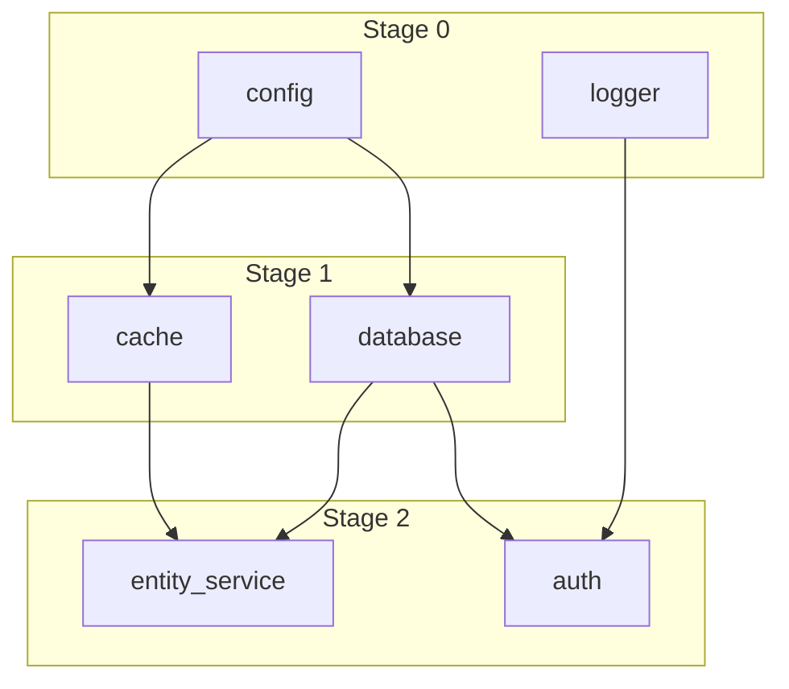

# Service Dependency Resolution Enhancement Guide

## Overview

Phase 2F introduces an enhanced dependency resolution system for ServiceRegistry that provides:

- **Circular dependency detection** with detailed error messages
- **Dependency visualization** using Mermaid diagrams
- **Stage optimization** for maximum parallelization
- **Runtime dependency validation**
- **Impact analysis** for service failures
- **Enhanced error messages** with available services and suggestions

## Architecture

### 1. Service Dependency Resolver (`backend/core/service_dependency_resolver.py`)

The core dependency resolution engine that provides:

```python
# Define service with dependencies
resolver = ServiceDependencyResolver()
resolver.add_service("entity_service", [
    ServiceDependency("database", type=DependencyType.REQUIRED),
    ServiceDependency("cache", type=DependencyType.OPTIONAL),
    ServiceDependency("websocket", type=DependencyType.RUNTIME),
])

# Resolve and get startup stages
stages = resolver.resolve_dependencies()
# Result: {0: ["database"], 1: ["entity_service"]}
```

### 2. Enhanced Service Registry (`backend/core/service_registry_v2.py`)

Extended ServiceRegistry with rich dependency metadata:

```python
registry = EnhancedServiceRegistry()

# Register service with full metadata
registry.register_service(
    name="auth_service",
    init_func=init_auth,
    dependencies=[
        ServiceDependency("database", type=DependencyType.REQUIRED),
        ServiceDependency("cache", type=DependencyType.OPTIONAL, fallback="memory_cache"),
    ],
    tags={"security", "core"},
    description="Authentication and authorization service",
    health_check=check_auth_health,
)
```

### 3. Dependency Types

Three types of dependencies are supported:

- **REQUIRED**: Service cannot start without this dependency
- **OPTIONAL**: Service can start with reduced functionality
- **RUNTIME**: Dependency needed only after startup

## Migration Guide

### Step 1: Update main.py Imports

```python
# Add enhanced imports
from backend.core.service_registry_v2 import EnhancedServiceRegistry
from backend.core.service_dependency_resolver import ServiceDependency, DependencyType
from backend.core.service_registry_migration import (
    migrate_to_enhanced_registry,
    apply_enhanced_stages_to_main,
)
```

### Step 2: Create Enhanced Registry

Replace the standard ServiceRegistry creation:

```python
# Before
service_registry = ServiceRegistry()

# After
service_registry = EnhancedServiceRegistry()
```

### Step 3: Register Services with Enhanced Metadata

```python
# Simple registration (backward compatible)
service_registry.register_service(
    name="config_service",
    init_func=init_config,
    dependencies=["app_settings"],  # Simple string dependencies still work
)

# Enhanced registration with full metadata
service_registry.register_service(
    name="entity_service",
    init_func=init_entity_service,
    dependencies=[
        ServiceDependency("persistence", type=DependencyType.REQUIRED),
        ServiceDependency("websocket", type=DependencyType.RUNTIME),
        ServiceDependency("cache", type=DependencyType.OPTIONAL, fallback="memory_cache"),
    ],
    tags={"core", "feature"},
    description="RV-C entity state management",
    health_check=entity_health_check,
)
```

### Step 4: Use Enhanced Features

```python
# Get dependency report
print(service_registry.get_dependency_report())

# Export Mermaid diagram
diagram = service_registry.export_dependency_diagram()

# Get services by tag
security_services = service_registry.get_services_by_tag("security")

# Get detailed service info
info = service_registry.get_service_info("entity_service")

# Check for impacted services
if failure:
    impacted = resolver.get_impacted_services("failed_service")
    logger.error(f"Service failure will impact: {impacted}")
```

## Error Messages

### Before (Basic ServiceRegistry)

```
Service 'entity_service' dependency 'cache' not available or not healthy
```

### After (Enhanced ServiceRegistry)

```
Service 'entity_service' has missing required dependencies: cache, websocket.
Available services: app_settings, database, persistence

Suggestion: Check if 'cache' service is registered or use fallback 'memory_cache'
```

## Circular Dependency Detection

The enhanced resolver detects and reports circular dependencies:

```
DependencyError: Circular dependencies detected:
  • auth → database → security_events → auth
  • cache → session_store → cache
```

## Dependency Visualization

Generate Mermaid diagrams for documentation:



## Runtime Dependency Validation

Validate that runtime dependencies are available:

```python
# After startup, validate runtime dependencies
missing = service_registry._resolver.validate_runtime_dependencies(
    available_services=set(service_registry.list_services())
)

if missing:
    for service, deps in missing.items():
        logger.warning(f"{service} missing runtime dependencies: {deps}")
```

## Health Check Integration

Enhanced health checks with dependency awareness:

```python
async def entity_health_check() -> bool:
    """Check entity service health including dependencies."""
    # Check own health
    if not entity_state_ok():
        return False

    # Check critical runtime dependencies
    if not websocket_connected():
        logger.warning("Entity service degraded: WebSocket not connected")
        return False  # Or return True with degraded status

    return True
```

## Performance Optimization

The enhanced resolver optimizes startup stages:

1. **Parallel Execution**: Services with no interdependencies start simultaneously
2. **Stage Optimization**: Services start as soon as dependencies are satisfied
3. **Depth Calculation**: Minimizes total startup time by optimal ordering

Example optimization:
```
Before: 6 sequential stages (one service per stage)
After: 3 optimized stages with parallelization
- Stage 0: config, logger (parallel)
- Stage 1: database, cache, file_service (parallel)
- Stage 2: auth, entity_service, api (parallel)
```

## Testing

```python
async def test_enhanced_startup():
    """Test enhanced service startup."""
    registry = EnhancedServiceRegistry()

    # Register test services
    registry.register_service(
        name="test_db",
        init_func=lambda: {"db": "initialized"},
        dependencies=[],
        tags={"test", "storage"},
    )

    registry.register_service(
        name="test_app",
        init_func=lambda: {"app": "initialized"},
        dependencies=[ServiceDependency("test_db")],
        tags={"test", "application"},
    )

    # Start services
    await registry.startup_all()

    # Verify startup order
    order = registry.get_startup_order()
    assert order == ["test_db", "test_app"]

    # Check health
    health = await registry.check_service_health("test_app")
    assert health == ServiceStatus.HEALTHY
```

## Monitoring and Metrics

Enhanced metrics provide detailed insights:

```python
metrics = registry.get_enhanced_metrics()
# {
#     "startup_time_seconds": 1.23,
#     "total_services": 15,
#     "total_stages": 4,
#     "services_by_tag": {
#         "core": 5,
#         "feature": 7,
#         "integration": 3
#     },
#     "dependency_resolution": {
#         "total_dependencies": 23,
#         "max_depth": 3
#     }
# }
```

## Best Practices

1. **Use Dependency Types**: Specify REQUIRED vs OPTIONAL vs RUNTIME
2. **Provide Fallbacks**: For optional dependencies, specify alternatives
3. **Tag Services**: Use tags for categorization and filtering
4. **Add Descriptions**: Help future developers understand service purposes
5. **Implement Health Checks**: Enable runtime health monitoring
6. **Document Dependencies**: Keep dependency documentation up to date

## Troubleshooting

### Issue: Circular dependency error

**Solution**: Review the dependency chain shown in the error message and remove the cycle.

### Issue: Service not starting

**Check**:
1. All required dependencies are registered
2. Dependencies are healthy
3. No circular dependencies
4. Initialization function is correct

### Issue: Slow startup

**Optimize**:
1. Review dependency report for unnecessary dependencies
2. Mark appropriate dependencies as OPTIONAL or RUNTIME
3. Check for services that could start in parallel

## Future Enhancements

1. **Dynamic dependency injection**: Add/remove dependencies at runtime
2. **Dependency versioning**: Support version constraints
3. **Lazy loading**: Defer optional dependency initialization
4. **Distributed dependencies**: Support remote service dependencies
