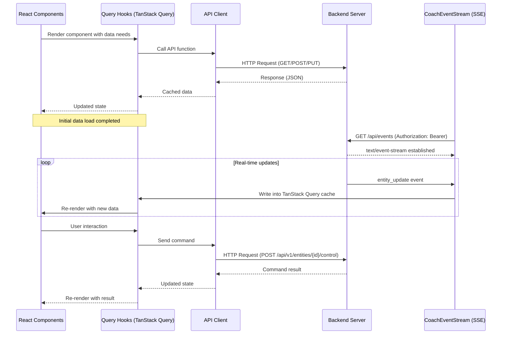

# Frontend API Integration

This page describes how the React frontend integrates with the CoachIQ backend API.

## Integration Architecture



Commands always go over REST; the SSE stream is server-push only.

## API Client Structure

The frontend uses a structured approach for API communication:

1. **API Types** (`src/api/types.ts`, `src/api/types/`): TypeScript interfaces matching the API response models
2. **API Client** (`src/api/client.ts`): `API_BASE`, fetch wrapper, and auth headers
3. **API Endpoints** (`src/api/endpoints.ts`, `src/api/domains/`): Functions to call specific API endpoints
4. **SSE Client** (`src/api/sse.ts`): `CoachEventStream`, the realtime channel

## Base API Configuration

The API base URL and common fetch options are defined in `src/api/client.ts`:

```typescript
/** Base URL for API requests (host origin; paths include /api themselves) */
export const API_BASE = /* derived from the deployment origin */;

// Common fetch options
const defaultOptions: RequestInit = {
  headers: {
    "Content-Type": "application/json",
  },
};
```

Requests carry the JWT access token as an `Authorization: Bearer` header (see
`src/lib/token-storage.ts`).

## Entity API Integration

### Fetching Entities

Entities are fetched using the unified Domain API v1 `/api/v1/entities`
endpoint (there are no per-device routes such as `/api/lights`):

```typescript
export async function fetchLights(): Promise<LightStatus[]> {
  const response = await fetch(
    `${API_BASE}/api/v1/entities?device_type=light`,
    defaultOptions
  );
  return handleApiResponse<LightStatus[]>(response);
}
```

In application code these fetchers are wrapped in TanStack Query hooks
(`src/hooks/useEntities.ts`), so realtime updates written into the query cache
reach components automatically.

### Controlling Entities

Entity control commands follow the standardized command format:

```typescript
export async function setLightState(
  id: string,
  state: boolean
): Promise<LightControlResponse> {
  const command = {
    command: "set",
    state, // boolean: true = on, false = off
  };

  const response = await fetch(`${API_BASE}/api/v1/entities/${id}/control`, {
    ...defaultOptions,
    method: "POST",
    body: JSON.stringify(command),
  });

  return handleApiResponse<LightControlResponse>(response);
}
```

### Setting Brightness

```typescript
export async function setLightBrightness(
  id: string,
  brightness: number
): Promise<LightControlResponse> {
  const command = {
    command: "set",
    state: true,
    brightness: Math.min(Math.max(0, Math.round(brightness)), 100),
  };

  const response = await fetch(`${API_BASE}/api/v1/entities/${id}/control`, {
    ...defaultOptions,
    method: "POST",
    body: JSON.stringify(command),
  });

  return handleApiResponse<LightControlResponse>(response);
}
```

## Realtime Integration (SSE)

The frontend receives real-time updates over one authenticated Server-Sent
Events stream, `GET /api/events`. The client is the `CoachEventStream` class
in `src/api/sse.ts`; it uses `fetch` + `ReadableStream` instead of the native
`EventSource` because `EventSource` cannot send an `Authorization` header. It
also handles reconnection backoff, a heartbeat stall watchdog,
`Last-Event-ID` gap replay, and token refresh on 401.

```typescript
import { CoachEventStream } from "@/api/sse";

const stream = new CoachEventStream({
  onEvent: (event, data) => {
    // event: "entity_update" | "entity_created" | "halt_command_emission"
    if (event === "entity_update") {
      const { entity_id, entity_data } = data as {
        entity_id: string;
        entity_data: Record<string, unknown>;
      };
      // update state for entity_id
    }
  },
  onStateChange: (state) => {
    // "connecting" | "open" | "down" | "auth-failed" | "closed"
  },
});

stream.start();
// later: stream.stop();
```

Application code should not create its own stream: `RealtimeProvider`
(`src/contexts/realtime-provider.tsx`) owns the single app-wide instance and
writes entity events straight into the TanStack Query cache
(`setQueryData` for `entity_update`, cache invalidation for `entity_created`
and `halt_command_emission`). Components observe stream health via the
`useRealtime()` hook.

WebSockets remain only for page-scoped diagnostic streams (`/ws/logs`,
`/ws/can-sniffer`, `/ws/can-recorder`, `/ws/can-analyzer`, `/ws/can-filter`)
used by the log viewer and CAN tooling pages — see the
[Realtime API Reference](websocket.md).

## Error Handling

The frontend uses a consistent error handling approach for API responses:

```typescript
export async function handleApiResponse<T>(response: Response): Promise<T> {
  if (!response.ok) {
    let errorMessage = `API Error: ${response.status}`;
    try {
      const errorData = await response.json();
      errorMessage = errorData.detail || errorMessage;
    } catch (e) {
      // Use default error message if we can't parse the response
    }
    throw new Error(errorMessage);
  }

  return response.json() as Promise<T>;
}
```

## Type Safety

The frontend uses TypeScript interfaces to ensure type safety when working with API responses:

```typescript
// Example entity interface (Domain API v1 shape)
interface Entity {
  entity_id: string;
  name: string;
  device_type: string;
  protocol: string;
  state: Record<string, unknown>;
  area: string | null;
  last_updated: string;
  available: boolean;
}

// Light-specific interface
interface LightStatus extends Entity {
  brightness?: number;
}
```

This ensures that API data is properly validated at compile-time.
