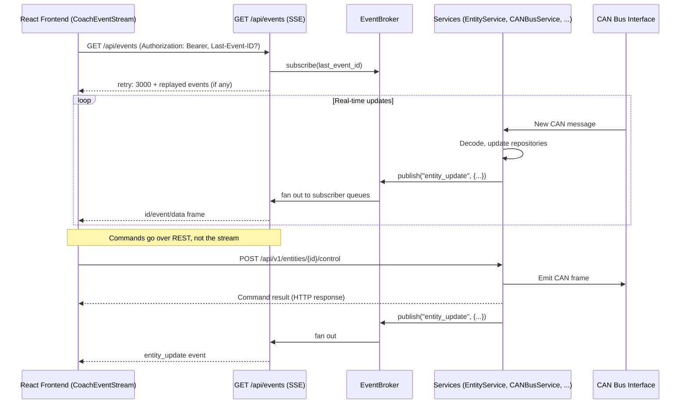

# Realtime API Reference

CoachIQ pushes real-time state to clients over a single authenticated
Server-Sent Events (SSE) stream at `GET /api/events`. Commands never ride the
realtime channel — they stay on REST (`POST /api/v1/entities/{id}/control`).

WebSockets survive only for page-scoped, high-frequency diagnostic streams
(logs and CAN tooling); see [Diagnostic WebSocket endpoints](#diagnostic-websocket-endpoints)
below. The old `/api/ws` entity-data socket (and the `/ws/network-map`,
`/ws/features`, and `/ws/security` sockets) have been removed.

## Realtime Communication Flow



State lives in the repository layer (see
[Repository Pattern](../architecture/repository-pattern.md)); there is no
monolithic "App State" object anymore.

## Connection

```text
GET /api/events
Accept: text/event-stream
Authorization: Bearer <access-token>
```

- **Authentication**: the endpoint is behind the standard
  `AuthenticationMiddleware` — it is *not* an excluded path. Send the usual
  `Authorization: Bearer` header. Because the native `EventSource` API cannot
  set request headers, the frontend implements the client with `fetch` + a
  `ReadableStream` reader (`frontend/src/api/sse.ts`, `CoachEventStream`).
- **Media type**: `text/event-stream` with `Cache-Control: no-cache` and
  `X-Accel-Buffering: no` (so buffering reverse proxies pass chunks through).
- **Heartbeat**: the server emits an SSE comment line (`: keepalive`) after
  15 seconds of idle. Clients treat prolonged silence as a dead connection
  (the frontend's stall watchdog aborts after 45 s and redials).
- **Reconnect hint**: the first frame on every connection is `retry: 3000`.

### Reconnection and gap replay (`Last-Event-ID`)

Every event carries a monotonically increasing integer `id`. The server keeps
a ring buffer of the last 1000 events (`EventBroker`,
`backend/services/system/event_broker.py`). On reconnect, send the standard
`Last-Event-ID` header with the last id you saw and the server replays the gap
before resuming live events.

A fresh connection (no `Last-Event-ID`) gets no replay — clients resync via
REST instead (the frontend invalidates its entity queries on every connect).

Per-subscriber queues are bounded (256 events) and lossy: if a client reads
too slowly, its oldest queued events are dropped rather than stalling the CAN
RX path. All published events are state snapshots, so a newer event always
supersedes a dropped older one.

## Event Types

Events use the SSE `event:` field for the type name and a JSON `data:` payload.

### `entity_update`

Published whenever an entity's state changes (CAN decode, control command,
Victron update, optimistic update):

```text
id: 42
event: entity_update
data: {"entity_id": "light_1", "entity_data": {"entity_id": "light_1", "state": "on", "operating_status": 100, ...}}
```

### `entity_created`

Published when a new entity mapping is created:

```text
id: 43
event: entity_created
data: {"entity_id": "light_2", "data": {...}}
```

### `halt_command_emission`

Published when the guardrail policy halts all entity command emission:

```text
id: 44
event: halt_command_emission
data: {"timestamp": 1751700000.0, "cancelled_operations": ["op-123"], "message": "All entity operations have been halted by guardrail policy"}
```

Producers today are `EntityService`, `EntityDomainService`, `VictronService`,
and `CANBusService`, all publishing through the shared `EventBroker` (wired in
the composition root, `backend/core/composition_root.py`, and injected via
`EventBrokerDep`).

## Usage in JavaScript

Because `EventSource` cannot send an `Authorization` header, use `fetch` with
a stream reader (this is what the app's `CoachEventStream` class does, with
reconnection backoff and `Last-Event-ID` tracking on top):

```javascript
const response = await fetch("/api/events", {
  headers: {
    Accept: "text/event-stream",
    Authorization: `Bearer ${accessToken}`,
    // On reconnect: "Last-Event-ID": String(lastEventId),
  },
  cache: "no-store",
});

const reader = response.body.getReader();
const decoder = new TextDecoder();
let buffer = "";

for (;;) {
  const { done, value } = await reader.read();
  if (done) break;
  buffer += decoder.decode(value, { stream: true });

  // Events are separated by a blank line.
  const frames = buffer.split("\n\n");
  buffer = frames.pop() ?? "";
  for (const frame of frames) {
    let eventType = "message";
    let data = "";
    for (const line of frame.split("\n")) {
      if (line.startsWith("event:")) eventType = line.slice(6).trim();
      else if (line.startsWith("data:")) data = line.slice(5).trim();
      // "id:" lines feed Last-Event-ID; ":" lines are keepalives.
    }
    if (!data) continue;
    const payload = JSON.parse(data);
    if (eventType === "entity_update") {
      // Update UI with payload.entity_id / payload.entity_data
    }
  }
}
```

In the React app you should not use the stream directly: `RealtimeProvider`
(`frontend/src/contexts/realtime-provider.tsx`) owns the single stream and
writes entity events into the TanStack Query cache; components consume state
through the normal query hooks and can check stream health via `useRealtime()`.

## Log streaming (SSE)

Live server logs stream over SSE at `GET /api/logs/stream` (admin-only,
bearer auth). Entries arrive batched as `event: logs` frames whose `data` is
a JSON array of `{timestamp, level, message, logger, service, thread}`
objects; on connect the most recent matching entries are replayed from an
in-memory ring buffer. Optional query params: `level` (minimum python level
name) and `modules` (comma-separated logger-name prefixes). Historical logs
are served by `GET /api/logs/history` (journald when available, otherwise the
in-memory buffer). The old `/ws/logs` WebSocket has been removed.

## Diagnostic WebSocket endpoints

Four WebSocket endpoints remain for page-scoped CAN diagnostic streams
(`backend/websocket/routes.py`). They are not part of the app-wide realtime
data plane:

| Endpoint           | Purpose                                          |
| ------------------ | ------------------------------------------------ |
| `/ws/can-sniffer`  | Raw CAN frame stream                             |
| `/ws/can-recorder` | CAN recorder status updates                      |
| `/ws/can-analyzer` | CAN analyzer statistics and messages             |
| `/ws/can-filter`   | CAN filter status and captured messages          |

Example:

```javascript
const wsProtocol = window.location.protocol === "https:" ? "wss:" : "ws:";
const socket = new WebSocket(
  `${wsProtocol}//${window.location.host}/ws/can-sniffer`,
);

socket.onmessage = (event) => {
  const entry = JSON.parse(event.data);
  console.log(entry);
};
```

These connections are authenticated by the `WebSocketAuthHandler`
(`backend/websocket/auth_handler.py`) against the same `AuthManager` used by
the HTTP middleware.
