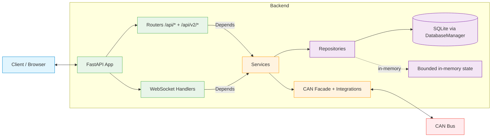

# Backend Architecture

The CoachIQ backend is a Python 3.12 + FastAPI service that talks to
the OEM Firefly MIRA panel over RV-C / J1939 CAN. Architecturally it
plays the same role as a smart wall-switch or HMI: it emits well-formed
CAN frames; the OEM controller decides whether to act on them.

For the architectural framing (what CoachIQ is and is not, the realistic
threat model, why we calibrate code quality to "good consumer-grade
backend" rather than aerospace), see
[`/memories/repo/coachiq-architecture.md`](../../memories/repo/coachiq-architecture.md)
or, once it lands, `docs/adr/ADR-0004-coachiq-is-not-the-safety-system.md`.

## Top-level layout

```text
backend/
├── main.py               # ASGI app construction + service registration
├── api/
│   ├── routers/          # Legacy /api/* endpoints
│   ├── domains/          # Domain API v2 (/api/v2/*)
│   └── router_config.py  # Mounts every router on the app
├── core/
│   ├── config.py         # Pydantic Settings (COACHIQ_* env vars)
│   ├── dependencies.py   # FastAPI Depends(get_*) helpers
│   ├── service_registry.py  # EnhancedServiceRegistry
│   ├── safety_state_engine.py
│   ├── service_dependency_resolver.py
│   ├── exception_handlers.py
│   └── exceptions.py
├── services/             # Business logic; constructor-injected
├── repositories/         # Data access; see repository-pattern.md
├── integrations/
│   ├── can/              # CAN bus + multi-network manager
│   ├── rvc/              # RV-C decoder, Firefly extensions
│   ├── j1939/            # J1939 decoder, Spartan K2 extensions
│   ├── analytics/        # PerformanceAnalyticsFeature
│   └── diagnostics/      # Cross-protocol diagnostics
├── middleware/           # Auth, CSRF, structured logging, etc.
├── models/               # Pydantic request/response models
├── schemas/              # Zod-exportable schemas for the frontend
├── websocket/            # WebSocket handlers + connection manager
└── alembic/              # SQLite migrations
```

## Component flow



The arrow from Routers to Services goes through FastAPI's `Depends(...)`
machinery (see [`repository-pattern.md`](repository-pattern.md) for the
canonical injection pattern). Services never reach back up to routers,
and they never reach across to other services without the registry
making the dependency explicit.

## Service lifecycle

1. **Construction** (in `backend/main.py`'s `_init_*` functions):
   each service is built with its dependencies passed as constructor
   arguments. This is also where dependency edges get declared
   (e.g. `EntityService` depends on `entity_state_repository`).

2. **Registration** (still in `main.py`): each constructed service is
   handed to `EnhancedServiceRegistry.register_service(name, init_func,
   dependencies)`.

3. **Stage planning**: at startup the registry's
   `ServiceDependencyResolver` builds a topological order of services
   and groups them into stages that can run concurrently. The startup
   log prints the stage plan.

4. **Startup**: `service_registry.startup_all()` runs each stage in
   order, awaiting all services in a stage in parallel.

5. **Lifespan**: services live for the duration of the FastAPI
   lifespan context. `service_registry.shutdown_all()` runs on
   shutdown in reverse stage order.

The registry has hardened semantics for missing-dependency detection,
circular-dependency detection, and a `fallback=` mechanism where a
service can declare an alternative dependency if the primary isn't
registered (see PR #135 for the bug fix that made `fallback=` actually
work in stage planning).

## API surface

Two API namespaces coexist:

- **`/api/*`** -- legacy routers under `backend/api/routers/`. Most of
  these are still active (auth, health, CAN tools, schemas, etc.).
  A few endpoints under this namespace have been retired in favor of
  v2 (notably `/api/entities` and `/api/missing-dgns`, both removed
  during the 2026-05 refactor).

- **`/api/v2/*`** -- domain API under `backend/api/domains/`. Mounted
  unconditionally by `register_all_domain_routers` in
  `backend/api/domains/__init__.py`. There are no feature flags around
  v2 routes; they are always on.

The legacy `/api/entities` -> `/api/v2/entities` transition is documented
in PR #126's docstring (and tested by
`tests/contract/test_domain_api_spec_validation.py`).

## State and data

- **SQL state** lives in SQLite via `DatabaseManager`. Migrations are
  managed by Alembic (`backend/alembic/`) and are applied at startup
  by `DatabaseUpdateService`.
- **In-memory state** (e.g. last-known entity values, CAN message
  history, system-state snapshots) lives in repositories with bounded
  collections to prevent memory growth. The
  `SystemStateRepository` is intentionally pure-in-memory.
- **Configuration** comes from Pydantic `Settings` driven by
  `COACHIQ_*` env vars. See `backend/core/config.py` and
  `docs/architecture/configuration-loading.md`.

## Real-time updates

The WebSocket layer (`backend/websocket/`) broadcasts entity-state
updates to connected clients. Connections are managed by the
`WebSocketManager` service (registered with the
`EnhancedServiceRegistry` like everything else); routers in
`backend/websocket/routes.py` mount the WS endpoints on the FastAPI
app.

When a CAN message decodes into an entity-state change:
1. The decoder writes the new state into `EntityStateRepository`.
2. `EntityService` (or whichever service owns the change) calls
   `WebSocketManager.broadcast_entity_change(...)`.
3. Connected clients see the update in <100ms typical.

## See also

- [Repository Pattern](repository-pattern.md) -- the data-access
  layer.
- [Configuration Loading](configuration-loading.md) -- how
  `rvc.json`, coach mappings, and `COACHIQ_*` env vars resolve.
- [Overview](overview.md) -- top-level system diagram.
- `backend/main.py` -- the source of truth for every service
  registration.
- `backend/core/service_registry.py` -- the registry implementation.
