# Current Service Dependencies

This document captures the current state of service dependencies as of Phase 0 of the Service Architecture Migration.

## Service Architecture Overview

The system currently has three overlapping service management systems:

1. **CoreServices** - Monolithic bundle containing database_manager, persistence_service
2. **ServiceRegistry** - Modern service registry with dependency resolution
3. **FeatureManager** - Feature-based service management system

## ServiceRegistry Services

Services currently registered in the ServiceRegistry:

### Core Services

#### app_settings
- **Type**: Configuration
- **Dependencies**: None
- **Description**: Application settings from environment
- **Init Function**: `_init_app_settings()`
- **Tags**: core, config

#### rvc_config
- **Type**: Configuration Provider
- **Dependencies**: None
- **Description**: RV-C configuration provider
- **Init Function**: `_init_rvc_config_provider()`
- **Tags**: core, config

#### core_services
- **Type**: Service Bundle
- **Dependencies**: app_settings
- **Description**: Core services bundle (database, persistence)
- **Init Function**: `_init_core_services()`
- **Tags**: core
- **Contains**:
  - database_manager
  - persistence_service (PersistenceService)

### Security Services

#### security_event_manager
- **Type**: Service Manager
- **Dependencies**: core_services (for database access)
- **Description**: Centralized security event management
- **Init Function**: `_init_security_event_manager()`
- **Tags**: security, core

#### security_config_service
- **Type**: Service
- **Dependencies**: app_settings
- **Description**: Centralized security configuration
- **Init Function**: lambda that creates SecurityConfigService
- **Tags**: security

#### pin_manager
- **Type**: Service
- **Dependencies**: security_config_service
- **Description**: PIN management for authentication
- **Init Function**: `_init_pin_manager()`
- **Tags**: security

#### security_audit_service
- **Type**: Service
- **Dependencies**: security_config_service
- **Description**: Security audit and rate limiting
- **Init Function**: `_init_security_audit_service()`
- **Tags**: security

#### network_security_service
- **Type**: Service
- **Dependencies**: None
- **Description**: Network security (TLS, encryption)
- **Init Function**: lambda that creates NetworkSecurityService
- **Tags**: security, network

### Device Services

#### device_discovery_service
- **Type**: Service
- **Dependencies**: None (CAN service injected later)
- **Description**: Device discovery on CAN bus
- **Init Function**: `_init_device_discovery_service()`
- **Tags**: device, can

### Group 2 Services (Registered via service_registry_update_v2.py)

These services are registered through a separate module and represent the new service architecture:

#### Repositories (No dependencies on each other)
- entity_state_repository
- rvc_config_repository
- can_tracking_repository
- diagnostics_repository
- journal_repository
- notification_analytics_repository
- analytics_repository
- coach_mapping_repository
- dashboard_config_repository
- entity_persistence_repository
- docs_repository
- persistence_repository

#### Services (Depend on repositories)
- auth_manager (depends on: journal_repository)
- database_manager (depends on: database services)
- entity_service (depends on: entity_state_repository, entity_persistence_repository)
- security_event_manager (depends on: security_event_repository, journal_repository)

## FeatureManager Services

Services managed by the FeatureManager:

### Core Features
- **app_state** - Application state management
- **websocket** - WebSocket manager
- **entity_manager** - Entity lifecycle management
- **auth_feature** - Authentication feature
- **can_feature** - CAN bus feature

### Integration Features
- **rvc** - RV-C protocol support
- **j1939** - J1939 protocol support
- **advanced_diagnostics** - Diagnostic features
- **notification** - Notification system
- **performance_analytics** - Analytics features

## Dependency Graph

```mermaid
graph TD
    %% ServiceRegistry Services
    app_settings[app_settings]
    rvc_config[rvc_config]
    core_services[core_services]
    security_event_manager[security_event_manager]
    security_config_service[security_config_service]
    pin_manager[pin_manager]
    security_audit_service[security_audit_service]
    network_security_service[network_security_service]
    device_discovery_service[device_discovery_service]

    %% Hidden services in core_services
    database_manager[database_manager - hidden]
    persistence_service[persistence_service - hidden]

    %% FeatureManager Services
    feature_manager[FeatureManager]
    app_state[app_state]
    websocket[websocket]
    entity_manager[entity_manager]
    auth_feature[auth_feature]
    can_feature[can_feature]

    %% Dependencies
    core_services --> app_settings
    security_event_manager --> core_services
    pin_manager --> security_config_service
    security_audit_service --> security_config_service
    security_config_service --> app_settings

    %% Hidden dependencies
    core_services --> database_manager
    core_services --> persistence_service

    %% FeatureManager dependencies
    feature_manager --> core_services
    app_state --> persistence_service
    websocket --> app_state
    entity_manager --> app_state
    auth_feature --> app_state
    can_feature --> app_state
```

## Issues Identified

1. **Hidden Services**: `database_manager` and `persistence_service` are hidden inside `core_services`, making them difficult to access directly
2. **Circular Dependencies**: During startup, CoreServices tries to get services from the registry while initializing
3. **Service Locator Pattern**: Services use `service_registry.get_service()` inside init functions instead of constructor injection
4. **Mixed Patterns**: Three different service management systems make the architecture complex
5. **Implicit Dependencies**: Many dependencies are not explicitly declared

## Migration Path

The migration plan addresses these issues in phases:

1. **Phase 0** (Current): Add visibility and documentation
2. **Phase 1**: Enhance ServiceRegistry for constructor injection
3. **Phase 2**: Extract services from CoreServices
4. **Phase 3**: Consolidate all registrations
5. **Phase 4**: Migrate FeatureManager services
6. **Phase 5**: Cleanup and documentation

## Next Steps

With Phase 0 complete, we now have:
- Dependency visualization in main.py logs
- Integration test suite for service resolution
- This documentation of current state

Phase 1 will enhance the ServiceRegistry to support proper constructor-based dependency injection.
