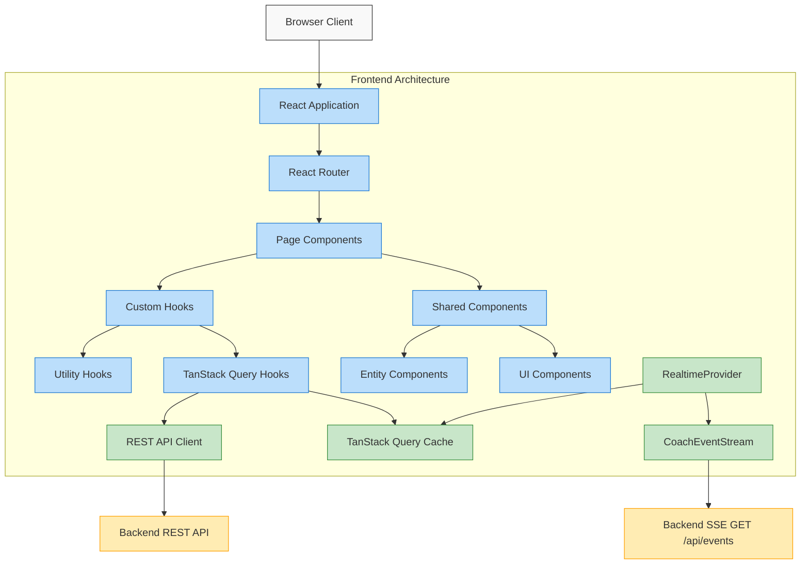

# Frontend Architecture

This page provides an overview of the CoachIQ frontend architecture, focusing on how it integrates with the API.

## Architecture Overview



## Core Components

The frontend is built using React, TypeScript, and Vite, with the following structure:

```
frontend/
├── public/            # Static assets
└── src/
    ├── api/           # API integration (REST client, SSE client, generated types)
    ├── components/    # React components
    ├── contexts/      # React context providers (auth, realtime, coach-connection)
    ├── hooks/         # Custom React hooks (TanStack Query + diagnostic WS hooks)
    ├── lib/           # Shared utilities (e.g. token storage)
    ├── pages/         # Page components
    ├── types/         # Shared TypeScript types
    └── utils/         # Utility functions
```

## API Integration

### API Module Structure

The API integration is organized in the `src/api` directory:

```
src/api/
├── index.ts          # Main API exports & utilities
├── client.ts         # Fetch wrapper, API_BASE, auth headers
├── endpoints.ts      # API endpoint functions
├── sse.ts            # CoachEventStream (SSE realtime client) + SseParser
├── domains/          # Domain API v1 (/api/v1/*) clients
├── types.ts, types/  # TypeScript interfaces for API models
└── websocket.ts      # Diagnostic WebSocket client (logs, CAN tools)
```

This structure separates concerns and allows for better type safety and maintainability.

### API Endpoints

API endpoints are defined in `endpoints.ts` as functions that:

1. Construct the appropriate URL
2. Set up request options
3. Make the fetch request
4. Handle errors and parse responses

Example:

```typescript
export async function fetchLights(): Promise<LightStatus[]> {
  // Note: the legacy /api/entities path was retired during the
  // 2026-05 refactor; only /api/v1/entities remains.
  const response = await fetch(
    `${API_BASE}/api/v1/entities?device_type=light`,
    defaultOptions
  );
  return handleApiResponse<LightStatus[]>(response);
}
```

### API Types

API types in `types.ts` define the structure of request and response data using TypeScript interfaces:

```typescript
// Domain API v1 entity shape
export interface Entity {
  entity_id: string;
  name: string;
  device_type: string;
  protocol: string;
  state: Record<string, unknown>;
  area: string | null;
  last_updated: string;
  available: boolean;
}

export interface LightStatus extends Entity {
  brightness?: number;
}
```

## State Management

Server state lives in the TanStack Query cache, accessed through custom query
hooks (e.g. `useEntities` in `src/hooks/useEntities.ts`); React context is
reserved for cross-cutting client state (auth, realtime health, coach
connection):

```typescript
// Example of a query hook for lights
export function useLights() {
  return useQuery({
    queryKey: entitiesQueryKeys.collection({ device_type: "light" }),
    queryFn: fetchLights,
  });
}
```

Because realtime entity events are written into the same cache (see below),
components get live data through the queries they already use — no separate
realtime state store.

## Realtime Integration (SSE)

Real-time updates arrive over a single authenticated Server-Sent Events
stream, `GET /api/events`. The client is the `CoachEventStream` class
(`src/api/sse.ts`), built on `fetch` + `ReadableStream` rather than the native
`EventSource` — `EventSource` cannot send the `Authorization: Bearer` header
the endpoint requires. It handles reconnection with jittered exponential
backoff, a stall watchdog keyed to the server's 15 s heartbeat, `Last-Event-ID`
gap replay on reconnect, and one token refresh on a 401.

`RealtimeProvider` (`src/contexts/realtime-provider.tsx`) owns the app's
single stream and routes events into the TanStack Query cache:

```typescript
// Inside RealtimeProvider — entity events land in the query cache
new CoachEventStream({
  onEvent: (event, data) => {
    if (event === "entity_update") {
      const payload = data as IEntityUpdatePayload;
      queryClient.setQueryData(
        entitiesQueryKeys.entity(payload.entity_id),
        payload.entity_data
      );
      void queryClient.invalidateQueries({ queryKey: entitiesQueryKeys.collections() });
    } else if (event === "entity_created" || event === "halt_command_emission") {
      void queryClient.invalidateQueries({ queryKey: entitiesQueryKeys.collections() });
    }
  },
});
```

Components read the stream's health with the `useRealtime()` hook
(`src/contexts/realtime-context.ts`), which exposes
`status: 'connected' | 'connecting' | 'down'`, an `authFailed` flag, and a
`reconnect()` action. The coach-connection provider
(`src/contexts/coach-connection.tsx`) combines this realtime health with CAN
bus activity (from `/api/v1/networks/status`) to derive the single
`LIVE | STALE | OFFLINE` coach verdict shown in the UI.

WebSocket hooks (`src/hooks/useWebSocket.ts`, `src/hooks/websocket/`) remain
only for the page-scoped diagnostic streams — `/ws/logs` for the log viewer
and `/ws/can-sniffer`, `/ws/can-recorder`, `/ws/can-analyzer`, `/ws/can-filter`
for the CAN tooling pages. Entity data no longer flows over WebSockets.

## Component Structure

Components are organized by feature, with each feature typically including:

- A container component that handles API calls and state
- Presentational components that render UI based on props
- Custom hooks for logic reuse

## TypeScript Integration

TypeScript is used throughout the application to ensure type safety, with:

- API types matching backend models
- Props interfaces for components
- Strong typing for hooks and utility functions
