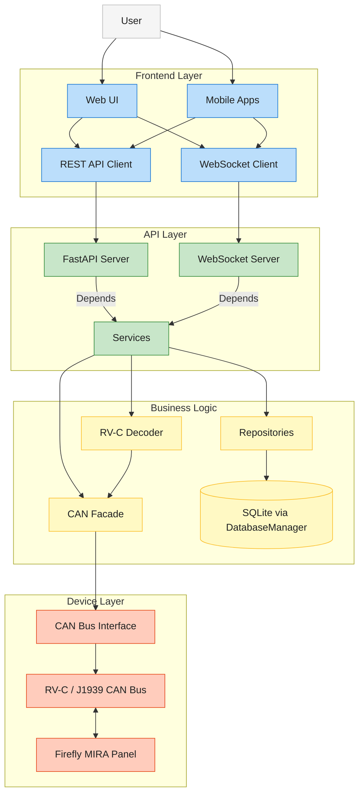

# Project Overview

The CoachIQ project provides a modern API and WebSocket service for RV-C (Recreational Vehicle Controller Area Network) systems, allowing you to monitor and control various devices in your RV.

## System Architecture

The system consists of several major components with clear separation of concerns:



> **What CoachIQ is and is not.** CoachIQ talks to the OEM Firefly MIRA
> multiplex panel over CAN. Firefly owns the actual vehicle-safety
> case (slide-with-brake interlocks, leveling-while-moving, etc.).
> CoachIQ plays the same role as a wall switch or HMI -- emit
> well-formed frames, trust Firefly to refuse the unsafe ones. See
> the architecture-decision record (or
> `/memories/repo/coachiq-architecture.md`) for the full framing.

### Backend Components

The backend is built with Python and FastAPI:

- **FastAPI Application**: Provides RESTful API and WebSocket endpoints
- **RV-C Decoder**: Translates CAN messages to/from human-readable formats
- **State Management**: Maintains entity states and histories
- **WebSocket Server**: Provides real-time updates to clients

### Frontend Components

The frontend is built with React, TypeScript, and Vite:

- **React Application**: Single-page application with modern UI
- **TypeScript**: Provides type safety and better developer experience
- **API Client**: Communicates with the backend API
- **WebSocket Client**: Receives real-time updates

## Directory Structure

The project follows a monorepo structure:

```text
coachiq/
├── backend/              # Python backend application
│   ├── api/              # FastAPI routers (legacy + domain v2)
│   ├── core/             # Config, ServiceRegistry, dependencies
│   ├── services/         # Business logic services
│   ├── repositories/     # Repository pattern data access
│   ├── integrations/     # CAN, RV-C, J1939, Firefly, Spartan K2
│   ├── middleware/       # Auth, CSRF, structured logging
│   ├── websocket/        # WebSocket handlers
│   ├── models/           # Pydantic request/response models
│   ├── schemas/          # Zod-exportable schemas for the frontend
│   └── alembic/          # SQLite migrations
├── frontend/             # React 19 + TypeScript + Vite SPA
├── docs/                 # Project documentation
└── scripts/              # Utility scripts
```

## Key Features

- **Entity Management**: Monitor and control RV entities like lights, tanks, thermostats
- **Real-time Updates**: WebSocket for instant updates on entity state changes
- **Unified API**: Consistent endpoint structure for all entity types
- **Type Safety**: Strong typing in both backend and frontend
- **Interactive Documentation**: Auto-generated API docs via OpenAPI/Swagger

## Development and Deployment

### Development

Development workflows are streamlined with:

- **Poetry**: Python dependency management
- **npm**: JavaScript dependency management
- **VS Code Tasks**: Common tasks for building, testing, and running
- **Pre-commit Hooks**: Code quality checks

### Deployment

The system can be deployed in various ways:

- **Docker**: Containerized deployment
- **NixOS**: Native integration with NixOS
- **Direct Installation**: On compatible Linux systems

## API Design Decision

All light-related API operations are consolidated under `/api/entities` endpoints (e.g., `/api/entities?device_type=light`). The legacy `/api/lights` endpoint is not used. This ensures a unified, type-safe, and extensible API surface for all entity types.

### Entity Control Command Structure

When controlling entities via the `/api/entities/{id}/control` endpoint, the request body must use the standardized command format:

```json
// Turn light on
{ "command": "set", "state": "on" }

// Set light brightness
{ "command": "set", "state": "on", "brightness": 75 }

// Toggle light state
{ "command": "toggle" }

// Adjust brightness
{ "command": "brightness_up" }
{ "command": "brightness_down" }
```

- [Feature Flags](architecture/feature-flags.md): Feature flag system, configuration, and runtime overrides
