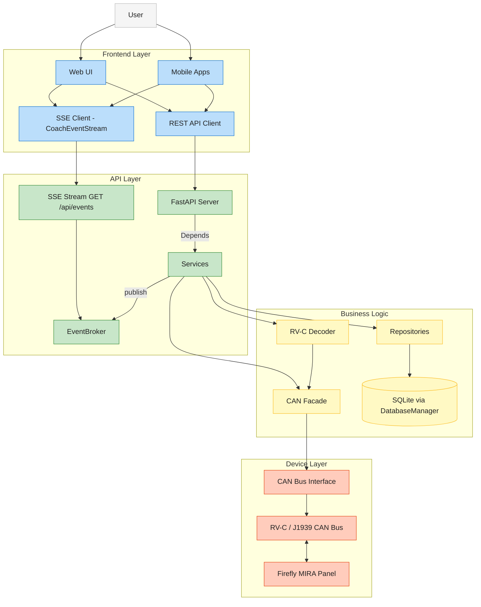

# Project Overview

The CoachIQ project provides a modern REST API with a real-time Server-Sent Events (SSE) stream for RV-C (Recreational Vehicle Controller Area Network) systems, allowing you to monitor and control various devices in your RV.

## System Architecture

The system consists of several major components with clear separation of concerns:



> **What CoachIQ is and is not.** CoachIQ talks to the OEM Firefly MIRA
> multiplex panel over CAN. Firefly owns the actual vehicle-safety
> case (slide-with-brake interlocks, leveling-while-moving, etc.).
> CoachIQ plays the same role as a wall switch or HMI -- emit
> well-formed frames, trust Firefly to refuse the unsafe ones. See
> the architecture-decision record (or
> `/memories/repo/coachiq-architecture.md`) for the full framing.

### Backend Components

The backend is built with Python and FastAPI:

- **FastAPI Application**: Provides the RESTful API, the SSE realtime stream, and diagnostic WebSocket endpoints
- **RV-C Decoder**: Translates CAN messages to/from human-readable formats
- **State Management**: Maintains entity states and histories via the repository layer
- **EventBroker**: In-process fan-out hub behind `GET /api/events`; services publish state changes, connected SSE clients receive them (with `Last-Event-ID` gap replay from a bounded ring buffer)
- **Diagnostic WebSockets**: Page-scoped streams for logs and CAN tooling (`/ws/logs`, `/ws/can-*`)

### Frontend Components

The frontend is built with React, TypeScript, and Vite:

- **React Application**: Single-page application with modern UI
- **TypeScript**: Provides type safety and better developer experience
- **API Client**: Communicates with the backend API
- **CoachEventStream / RealtimeProvider**: Owns the single SSE connection; entity events land in the TanStack Query cache

## Directory Structure

The project follows a monorepo structure:

```text
coachiq/
├── backend/              # Python backend application
│   ├── api/              # FastAPI routers (legacy /api/* + domain v1 at /api/v1/*)
│   ├── core/             # Config, ServiceRegistry, dependencies
│   ├── services/         # Business logic services
│   ├── repositories/     # Repository pattern data access
│   ├── integrations/     # CAN, RV-C, J1939, Firefly, Spartan K2
│   ├── middleware/       # Auth, CSRF, structured logging
│   ├── websocket/        # Diagnostic WebSocket routes (logs, CAN tools)
│   ├── models/           # Pydantic request/response models
│   ├── schemas/          # Zod-exportable schemas for the frontend
│   └── alembic/          # SQLite migrations
├── frontend/             # React 19 + TypeScript + Vite SPA
├── docs/                 # Project documentation
└── scripts/              # Utility scripts
```

## Key Features

- **Entity Management**: Monitor and control RV entities like lights, tanks, thermostats
- **Real-time Updates**: Authenticated SSE stream (`GET /api/events`) for instant updates on entity state changes; WebSockets remain only for diagnostic streams (logs, CAN tools)
- **Unified API**: Consistent endpoint structure for all entity types
- **Type Safety**: Strong typing in both backend and frontend
- **Interactive Documentation**: Auto-generated API docs via OpenAPI/Swagger

## Development and Deployment

### Development

Development workflows are streamlined with:

- **Poetry**: Python dependency management
- **npm**: JavaScript dependency management
- **VS Code Tasks**: Common tasks for building, testing, and running
- **Pre-commit Hooks**: Code quality checks

### Deployment

The system can be deployed in various ways:

- **Docker**: Containerized deployment
- **NixOS**: Native integration with NixOS
- **Direct Installation**: On compatible Linux systems

## API Design Decision

All light-related API operations are consolidated under the Domain API v1 `/api/v1/entities` endpoints (e.g., `/api/v1/entities?device_type=light`). There is no per-device `/api/lights` route, and the legacy unversioned `/api/entities` router has been retired (see ADR-0003 and ADR-0011). This ensures a unified, type-safe, and extensible API surface for all entity types.

### Entity Control Command Structure

When controlling entities via the `/api/v1/entities/{entity_id}/control` endpoint, the request body must use the standardized command format:

```json
// Turn light on
{ "command": "set", "state": true }

// Set light brightness
{ "command": "set", "state": true, "brightness": 75 }

// Toggle light state
{ "command": "toggle" }

// Adjust brightness
{ "command": "brightness_up" }
{ "command": "brightness_down" }
```
