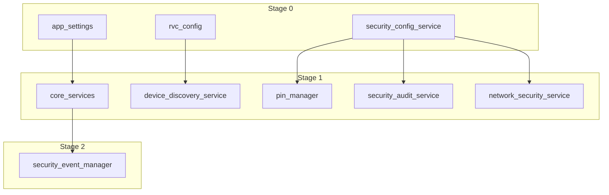

# Service Dependency Documentation

Generated from EnhancedServiceRegistry configuration in `backend/main.py`.

## Service Overview

| Service | Description | Tags | Dependencies |
|---------|-------------|------|--------------|
| app_settings | Application configuration and settings | core, configuration | None |
| rvc_config | RV-C specification and device mapping configuration | core, configuration, rvc | None |
| core_services | Database and persistence infrastructure | core, infrastructure, database | app_settings (REQUIRED) |
| security_event_manager | Security event logging and audit trail management | security, events, audit | core_services (REQUIRED) |
| device_discovery_service | RV-C device discovery and network scanning | discovery, rvc, network | rvc_config (REQUIRED), can_service (OPTIONAL) |
| security_config_service | Centralized security configuration management | security, configuration | None |
| pin_manager | PIN-based authorization for safety operations | security, safety, authentication | security_config_service (REQUIRED) |
| security_audit_service | Security audit logging and rate limiting | security, audit, monitoring | security_config_service (REQUIRED) |
| network_security_service | Network security monitoring and protection | security, network, protection | security_config_service (REQUIRED) |

## Startup Stages

Services are automatically grouped into stages based on dependencies:

### Stage 0
- **app_settings**: Application configuration and settings (deps: none)
- **rvc_config**: RV-C specification and device mapping configuration (deps: none)
- **security_config_service**: Centralized security configuration management (deps: none)

### Stage 1
- **core_services**: Database and persistence infrastructure (deps: app_settings)
- **device_discovery_service**: RV-C device discovery and network scanning (deps: rvc_config, can_service)
- **pin_manager**: PIN-based authorization for safety operations (deps: security_config_service)
- **security_audit_service**: Security audit logging and rate limiting (deps: security_config_service)
- **network_security_service**: Network security monitoring and protection (deps: security_config_service)

### Stage 2
- **security_event_manager**: Security event logging and audit trail management (deps: core_services)

## Dependency Graph

